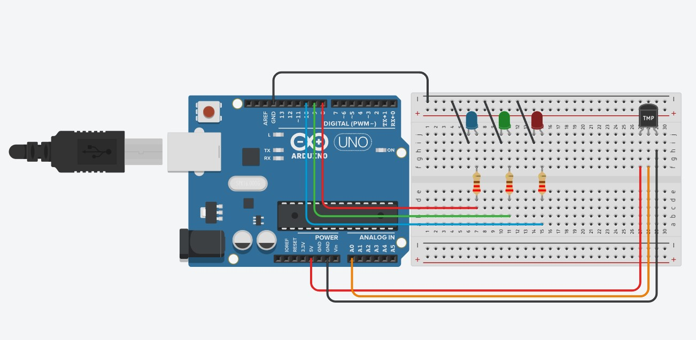
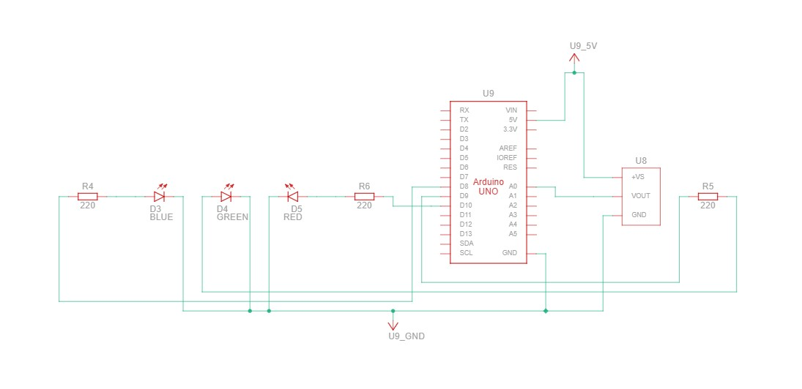

# Electronics Tasks

Collection of electronics laboratory reports and presentations originally
published on SlideShare. 

## Index

| # | Topic | SlideShare | Authors | Verified |
|---|-------|------------|---------|----------|
| 01 | Key Challanges | [link](https://www.slideshare.net/slideshow/key-challenges-and-development-barriers-in-azerbaijan-s-electronics-industry-by-nazrin-aliyeva-fazil-isgandar/287388256) | Fazil Isgandar | verified by: physics teacher azerbaijan telman askeraliyev (fizika muellimi) – contact: [LinkedIn](https://www.linkedin.com/in/physics-teacher-azerbaijan-telman-askeraliyev/) · [Instagram](https://www.instagram.com/physics_teacher_azerbaijan) |
| 02 | Technical Laboratory Report: Transistor | [link](https://www.slideshare.net/slideshow/technical-laboratory-report-transistor-ulker-aliyeva-nazile-aliyeva-fazil-isgender-ali-shukurov-verified-by-physics-teacher-azerbaijan-telman-askeraliyev-fizika-muellimi-azerbaijan-baku-5488/286914741) | Ulker Aliyeva · Nazile Aliyeva · Fazil Isgender · Ali Shukurov | verified by: physics teacher azerbaijan telman askeraliyev (fizika muellimi) – contact: [LinkedIn](https://www.linkedin.com/in/physics-teacher-azerbaijan-telman-askeraliyev/) · [Instagram](https://www.instagram.com/physics_teacher_azerbaijan) |
| 03 | Capacitor | [link](https://www.slideshare.net/slideshow/capacitor_task-nazrin-dilara-fazil/286799624) | Fazil Isgandar | verified by: physics teacher azerbaijan telman askeraliyev (fizika muellimi) – contact: [LinkedIn](https://www.linkedin.com/in/physics-teacher-azerbaijan-telman-askeraliyev/) · [Instagram](https://www.instagram.com/physics_teacher_azerbaijan) |
| 04 | Technical Laboratory Report: Voltage Regulator | [link](https://www.slideshare.net/slideshow/technical-laboratory-report-voltage-regulator-ulker-aliyeva-nazile-aliyeva-fazil-isgender-verified-by-physics-teacher-azerbaijan-telman-askeraliyev-fizika-muellimi-azerbaijan-baku/287505121) | Ulker Aliyeva · Nazile Aliyeva · Fazil Isgender | verified by: physics teacher azerbaijan telman askeraliyev (fizika muellimi) – contact: [LinkedIn](https://www.linkedin.com/in/physics-teacher-azerbaijan-telman-askeraliyev/) · [Instagram](https://www.instagram.com/physics_teacher_azerbaijan) |
| 05 | Technical Laboratory Report: Light-Sensitive Switch (LDR & Voltage Divider) | [link](https://www.academia.edu/166125872/Technical_Laboratory_Report_The_Light_Sensitive_Switch_LDR_Voltage_Divider) | Ulker Aliyeva · Nazile Aliyeva · Fazil Isgender | verified by: physics teacher azerbaijan telman askeraliyev (fizika muellimi) – contact: [LinkedIn](https://www.linkedin.com/in/physics-teacher-azerbaijan-telman-askeraliyev/) · [Instagram](https://www.instagram.com/physics_teacher_azerbaijan) |
| 06 | Electronics Project — 12/03 | [link](https://www.notion.so/Electronics-project-12-03-321bd0fa66d980c0862fe754a10fa3b2) | Ulker Aliyeva · Nazile Aliyeva · Fazil Isgender | verified by: physics teacher azerbaijan telman askeraliyev (fizika muellimi) – contact: [LinkedIn](https://www.linkedin.com/in/physics-teacher-azerbaijan-telman-askeraliyev/) · [Instagram](https://www.instagram.com/physics_teacher_azerbaijan) |
| 07 | Physics Guide: Field Effect Transistors (FETs) | [link](https://www.slideshare.net/slideshow/pyysics-guide-field-effect-transistors-fets-nazrin-aliyeva-ulkar-aliyeva-nazila-aliyeva-ali-shukurov/287153252) | Nazrin Aliyeva · Ulkar Aliyeva · Nazila Aliyeva · Ali Shukurov · Fazil Isgandar | verified by: physics teacher azerbaijan telman askeraliyev (fizika muellimi) – contact: [LinkedIn](https://www.linkedin.com/in/physics-teacher-azerbaijan-telman-askeraliyev/) · [Instagram](https://www.instagram.com/physics_teacher_azerbaijan) |
| 08 | Temperature-Controlled LED Indicator System Using Arduino Uno and TMP Analog Sensor | [link](https://www.academia.edu/167366213/Temperature_Controlled_LED_Indicator_System_Using_Arduino_Uno_and_TMP_Analog_Sensor_by_Fazil_Isgender_Verified_by_Physics_Teacher_Azerbaijan_Telman_Askeraliyev_Fizika_Muellimi_Azerbaijan_Baku_) | Fazil Isgandar | verified by: physics teacher azerbaijan telman askeraliyev (fizika muellimi) – contact: [LinkedIn](https://www.linkedin.com/in/physics-teacher-azerbaijan-telman-askeraliyev/) · [Instagram](https://www.instagram.com/physics_teacher_azerbaijan) |
| 09 | Temperature-Controlled LED Indicator System Using Arduino Uno and TMP Analog Sensor Videos | [link](https://drive.google.com/drive/folders/1Kg7MaWp6C6Axm9R0tR1KJgl8GgRf-P8l?usp=sharing) | Fazil Isgandar | verified by: physics teacher azerbaijan telman askeraliyev (fizika muellimi) – contact: [LinkedIn](https://www.linkedin.com/in/physics-teacher-azerbaijan-telman-askeraliyev/) · [Instagram](https://www.instagram.com/physics_teacher_azerbaijan) |
| 10 | Copybook | [link](https://drive.google.com/drive/folders/1li1tupU1iBHvFcZv24-51K6WvO_iCWcg?usp=sharing) | Fazil Isgandar | verified by: physics teacher azerbaijan telman askeraliyev (fizika muellimi) – contact: [LinkedIn](https://www.linkedin.com/in/physics-teacher-azerbaijan-telman-askeraliyev/) · [Instagram](https://www.instagram.com/physics_teacher_azerbaijan) |
---

-------------------
1.Topic

https://www.slideshare.net/slideshow/key-challenges-and-development-barriers-in-azerbaijan-s-electronics-industry-by-nazrin-aliyeva-fazil-isgandar/287388256

---

## Audit Structure

- Quick summary of the listing
- Identified gaps (4 key issues found in the original posting)
- Recommendations for each gap
- Practical improvements for clarity, scope, and candidate requirements|

---

## Subject

- **Field:** Electrical Engineering / ELV & LV System Design
- **Type:** Audit / Job Listing Analysis
- **Language:** English
- **Location:** Azerbaijan, Baku

--------------------
2.Topic

https://www.slideshare.net/slideshow/technical-laboratory-report-transistor-ulker-aliyeva-nazile-aliyeva-fazil-isgender-ali-shukurov-verified-by-physics-teacher-azerbaijan-telman-askeraliyev-fizika-muellimi-azerbaijan-baku-5488/286914741

verified by: physics teacher azerbaijan telman askeraliyev (fizika muellimi) – contact: https://www.linkedin.com/in/physics-teacher-azerbaijan-telman-askeraliyev/
https://www.instagram.com/physics_teacher_azerbaijan

# Transistor — Technical Laboratory Report

A 6-slide technical laboratory report on transistors — covering definitions,
operating principles, types (NPN/PNP), and circuit applications. Compiled as
part of an Electronics laboratory module.

**Authors:** Ulker Aliyeva · Nazile Aliyeva · Fazil Isgender · Ali Shukurov
**Verified by:** Telman Askeraliyev — Physics Teacher, Azerbaijan, Baku (Fizika Muellimi)

---

## Topics Covered

- What is a transistor — controlling or amplifying electrical signals
- Two main roles: digital switch (ON/OFF) and analog amplifier (gain)
- Three terminals: Collector (C), Base (B), Emitter (E)
- Three semiconductor layers (NPN / PNP construction)
- Operating regions: cut-off, active, saturation
- Practical lab observations

---

## Subject

- **Field:** Electronics / Semiconductor Devices
- **Type:** Technical Laboratory Report
- **Language:** English
- **Location:** Azerbaijan, Baku

--------------------
3.Topic

https://www.slideshare.net/slideshow/capacitor_task-nazrin-dilara-fazil/286799624

verified by: physics teacher azerbaijan telman askeraliyev (fizika muellimi) – contact: https://www.linkedin.com/in/physics-teacher-azerbaijan-telman-askeraliyev/
https://www.instagram.com/physics_teacher_azerbaijan

# Capacitor — Fundamentals Infographic

A 1-slide visual infographic introducing the capacitor: a passive electronic
component that stores electrical energy in an electric field between two
conductive plates separated by a dielectric.

---

## Core Concepts

- **Structure** — Parallel plates with a dielectric insulator
- **Charging** — Positive and negative charges accumulate on opposite plates when connected to a battery
- **Energy** — Builds up an electric field, storing energy
- **Behaviour** — Releases & discharges energy when needed
- **Common types** — Ceramic, Electrolytic, Film
- **Key features** — Stores energy, releases quickly, no current flow through
- **Applications** — Smoothing & filtering, timing circuits, power supply stabilization

---

## Subject

- **Field:** Electronics / Passive Components
- **Type:** Educational Infographic
- **Language:** English
- **Location:** Azerbaijan, Baku

--------------------
4.Topic

https://www.slideshare.net/slideshow/technical-laboratory-report-voltage-regulator-ulker-aliyeva-nazile-aliyeva-fazil-isgender-verified-by-physics-teacher-azerbaijan-telman-askeraliyev-fizika-muellimi-azerbaijan-baku/287505121

verified by: physics teacher azerbaijan telman askeraliyev (fizika muellimi) – contact: https://www.linkedin.com/in/physics-teacher-azerbaijan-telman-askeraliyev/
https://www.instagram.com/physics_teacher_azerbaijan

# Voltage Regulators — Principles, Types & Applications

An 8-slide technical laboratory report on voltage regulators — devices that
maintain a constant output voltage despite variations in input voltage, load
current, or temperature. Prepared as part of an Electronics Engineering /
Power Systems laboratory module.

**Authors:** Ulker Aliyeva · Nazile Aliyeva · Fazil Isgender
**Verified by:** Telman Askeraliyev — Physics Teacher, Azerbaijan, Baku (Fizika Muellimi)

---

## Topics Covered

- **Definition** — Active circuits that maintain a stable DC output voltage
- **Linear Regulators** — Series-pass transistor controlled by feedback (LDO, fixed, adjustable)
- **Switching Regulators** — Buck (step-down), Boost (step-up), Buck-Boost topologies
- **Key Parameters** — Line regulation, load regulation, dropout voltage, efficiency, ripple
- **Common ICs** — 78xx / 79xx fixed regulators, LM317 adjustable, LM7805 family
- **Applications** — Power supplies, microcontroller power rails, battery-powered devices, automotive electronics

---

## Linear vs Switching Regulators

| Property | Linear | Switching |
|----------|--------|-----------|
| Efficiency | Low (V_out / V_in) | High (up to 95%) |
| Heat dissipation | High | Low |
| Output noise | Very low | Switching ripple present |
| Complexity | Simple | More complex (inductor + control) |
| Best use | Low ΔV, low current | High ΔV or high current |

---

## Subject

- **Field:** Electronics Engineering / Power Systems
- **Type:** Technical Laboratory Report
- **Language:** English
- **Location:** Azerbaijan, Baku

--------------------
5.Topic

https://www.academia.edu/166125872/Technical_Laboratory_Report_The_Light_Sensitive_Switch_LDR_Voltage_Divider

verified by: physics teacher azerbaijan telman askeraliyev (fizika muellimi) – contact: https://www.linkedin.com/in/physics-teacher-azerbaijan-telman-askeraliyev/
https://www.instagram.com/physics_teacher_azerbaijan

# Technical Laboratory Report — The Light-Sensitive Switch (LDR & Voltage Divider)

A laboratory report on the design, simulation, and analysis of a Light-Sensitive
Switch built around a Light Dependent Resistor (LDR) and a voltage-divider
network. The LDR's resistance varies with ambient illumination; combined with a
fixed resistor it forms a voltage divider whose output reflects light intensity.
This output is used to switch a load on or off when light crosses a chosen
threshold — the basis of automatic street lights, dark-activated alarms, and
many sensor-driven circuits.

**Authors:** Ulker Aliyeva · Nazile Aliyeva · Fazil Isgender
**Verified by:** Telman Askeraliyev — Physics Teacher, Azerbaijan, Baku (Fizika Muellimi)

---

## Topics Covered

- **LDR Working Principle** — Photoresistive material whose resistance falls as light increases
- **Voltage Divider** — `V_out = V_S × R / (R + R_LDR)` giving a light-dependent voltage
- **Threshold Selection** — Choosing R to set the switching light level
- **Switching Element** — Transistor/comparator that turns the load on at threshold
- **Practical Design** — Component selection, supply considerations, real measurements
- **Applications** — Automatic lighting, dark-activated alarms, light-sensing toys

---

## Hosting

Full report (with figures and lab data) is hosted on Academia.edu — see the link
at the top of this section.

---

## Subject

- **Field:** Electronics / Sensor Circuits
- **Type:** Technical Laboratory Report
- **Language:** English
- **Location:** Azerbaijan, Baku

--------------------
6.Topic

https://www.notion.so/Electronics-project-12-03-321bd0fa66d980c0862fe754a10fa3b2

verified by: physics teacher azerbaijan telman askeraliyev (fizika muellimi) – contact: https://www.linkedin.com/in/physics-teacher-azerbaijan-telman-askeraliyev/
https://www.instagram.com/physics_teacher_azerbaijan

# Electronics Project — 12/03

A live electronics project workspace maintained on Notion, covering the project
plan, schematics, design notes, simulation/measurement results, and conclusions
for the 12/03 milestone.

**Authors:** Ulker Aliyeva · Nazile Aliyeva · Fazil Isgender
**Verified by:** Telman Askeraliyev — Physics Teacher, Azerbaijan, Baku (Fizika Muellimi)

---

## Workspace Contents

- Project objective and scope
- Component list and circuit schematic
- Step-by-step build / simulation notes
- Measurements, observations, and analysis
- Conclusions and next steps

---

## Hosting

Full project notes, attachments, and ongoing updates are maintained in the
linked Notion page above.

---

## Subject

- **Field:** Electronics / Project Documentation
- **Type:** Live Project Workspace
- **Language:** English
- **Location:** Azerbaijan, Baku

--------------------
7.Topic

https://www.slideshare.net/slideshow/pyysics-guide-field-effect-transistors-fets-nazrin-aliyeva-ulkar-aliyeva-nazila-aliyeva-ali-shukurov/287153252

verified by: physics teacher azerbaijan telman askeraliyev (fizika muellimi) – contact: https://www.linkedin.com/in/physics-teacher-azerbaijan-telman-askeraliyev/
https://www.instagram.com/physics_teacher_azerbaijan

# Physics Guide: Field Effect Transistors (FETs)

A 7-slide visual physics guide on Field Effect Transistors — covering JFET and
MOSFET structure and behaviour, key parameters, biasing configurations, and a
set of review questions and exercises.

**Authors:** Nazrin Aliyeva · Ulkar Aliyeva · Nazila Aliyeva · Ali Shukurov · Fazil Isgandar
**Verified by:** Telman Askeraliyev — Physics Teacher, Azerbaijan, Baku (Fizika Müəllimi)

---

## Slide Overview

| # | Section | Content |
|---|---------|---------|
| 1 | What is a FET? | Voltage-controlled device, high input impedance, low power consumption |
| 2 | Types of FETs | JFET (Junction Gate) vs MOSFET (Metal-Oxide Semiconductor) |
| 3 | JFET Characteristics | Shockley equation, I_DSS, pinch-off voltage V_P |
| 4 | MOSFET Characteristics | Operating regions: cut-off, triode/linear, saturation; threshold voltage |
| 5 | Important Parameters | Drain current at V_GS = 0, pinch-off voltage, threshold voltage, transconductance, output & input resistance |
| 6 | Biasing Configurations | JFET biasing (reverse-biased gate via R_S) and MOSFET biasing (voltage divider) |
| 7 | Questions & Exercises | Transfer characteristics, JFET vs MOSFET comparison, MOSFET bias-point design |

---

## Key Equations

| Quantity | Formula |
|----------|---------|
| Shockley equation (JFET) | `I_D = I_DSS × (1 − V_GS / V_P)²` |
| Max drain current | `I_DSS` (at V_GS = 0) |
| Pinch-off voltage | `V_P` (JFET) |
| Threshold voltage | `V_th` (MOSFET) |

---

## JFET vs MOSFET

| Property | JFET | MOSFET |
|----------|------|--------|
| Gate type | PN-junction (reverse biased) | Insulated by oxide layer |
| Input impedance | Very high | Extremely high |
| Modes | Depletion-mode | Depletion or Enhancement |
| Biasing | Self-bias via R_S | Voltage divider |
| Use | Analog signal stages | Digital logic, power switching |

---

## Subject

- **Field:** Electronics / Semiconductor Devices
- **Type:** Educational Visual Guide
- **Language:** English
- **Location:** Azerbaijan, Baku
------------------
8.Topic

Project:
(https://www.academia.edu/167366213/Temperature_Controlled_LED_Indicator_System_Using_Arduino_Uno_and_TMP_Analog_Sensor_by_Fazil_Isgender_Verified_by_Physics_Teacher_Azerbaijan_Telman_Askeraliyev_Fizika_Muellimi_Azerbaijan_Baku_)

Tinkercad Simulation:
https://www.tinkercad.com/things/dRYOouePuuV-fantastic-curcan-rottis?sharecode=WpkcSDcH8ULSNqUQKirr_tfXIZ1NosJOs_4Btt0cpd0


verified by: physics teacher azerbaijan telman askeraliyev (fizika muellimi) – contact: https://www.linkedin.com/in/physics-teacher-azerbaijan-telman-askeraliyev/
https://www.instagram.com/physics_teacher_azerbaijan

# Temperature-Controlled LED Indicator System Using Arduino Uno and TMP Analog Sensor

This paper presents the design and implementation of a temperature-controlled LED indicator system using an Arduino Uno microcontroller and a TMP analog temperature sensor. The circuit progressively activates three LEDs (blue, green, red) based on real-time temperature thresholds, providing a visual representation of thermal conditions. Current-limiting resistors of 220 Ohm protect each LED, and all calculations confirm safe operation within component ratings.
**Author:** Fazil Isgender
**Verified by:** Telman Askeraliyev — Physics Teacher, Azerbaijan, Baku (Fizika Muellimi)

---
 
## Project Overview
 
| Part        | Approach                      | Key components                                              | Output                                      |
| ----------- | ----------------------------- | ----------------------------------------------------------- | ------------------------------------------- |
| **Project** | Arduino + analog TMP sensor   | TMP sensor · Arduino UNO · 3× LED (Blue/Green/Red) · 3× 220 Ω | LEDs activate progressively with temperature |
 
---
 
## Circuit
 
[](8_temperature_led_indicator/breadboard.jpg)
 
[](8_temperature_led_indicator/schematic.jpg)
 
Three LEDs connect from digital pins D8, D9, D10 through 220 Ω
current-limiting resistors to GND. The TMP sensor is powered from the 5 V
rail, its VOUT pin feeds analog pin A0, and a 220 Ω resistor connects it
to GND.
 
---
 
## Arduino Sketch
 
```cpp
int led1 = 8;   // Blue LED
int led2 = 9;   // Green LED
int led3 = 10;  // Red LED
int temp;
int temppin = A0;
 
void setup() {
  pinMode(led1, OUTPUT);
  pinMode(led2, OUTPUT);
  pinMode(led3, OUTPUT);
  Serial.begin(9600);
}
 
void loop() {
  temp = ((analogRead(temppin) * 4.88) - 500) / 10;
  Serial.print("temp=");
  Serial.println(temp);
 
  if (temp < 25) {
    digitalWrite(led1, HIGH);   // Blue ON
    digitalWrite(led2, LOW);
    digitalWrite(led3, LOW);
  }
  if ((temp > 25) && (temp < 50)) {
    digitalWrite(led1, HIGH);   // Blue + Green ON
    digitalWrite(led2, HIGH);
    digitalWrite(led3, LOW);
  }
  if (temp > 50) {
    digitalWrite(led1, HIGH);   // All ON
    digitalWrite(led2, HIGH);
    digitalWrite(led3, HIGH);
  }
}
```
 
**Temperature conversion formula:**
`temp = (analogRead(A0) × 4.88 − 500) / 10`
 
The TMP sensor outputs 10 mV/°C with a 500 mV offset at 0°C.
The 4.88 factor converts the 10-bit ADC value to millivolts (5000 mV / 1024).
 
---
 
## LED Behaviour by Temperature Zone
 
| Zone | Temperature  | Blue LED | Green LED | Red LED | Meaning              |
| ---- | ------------ | -------- | --------- | ------- | -------------------- |
| Cold | Below 25°C   | ON       | OFF       | OFF     | Low temperature      |
| Warm | 25°C – 50°C  | ON       | ON        | OFF     | Moderate temperature |
| Hot  | Above 50°C   | ON       | ON        | ON      | High temperature     |
 
---
 
## Key Calculations
 
**Current through each LED:** `I = (Vcc − Vf) / R`
 
Forward voltages determined experimentally in TinkerCAD simulation:
 
| LED   | Vf (V) | R (Ω) | I_LED (mA) | Status          |
| ----- | ------ | ----- | ---------- | --------------- |
| Blue  | 4.88   | 220   | 0.55       | Safe (< 20 mA)  |
| Green | 3.52   | 220   | 6.73       | Safe (< 20 mA)  |
| Red   | 3.08   | 220   | 8.73       | Safe (< 20 mA)  |
 
**Burnout threshold** (minimum resistor before LED failure, verified by simulation):
 
```
Red   → burns out at R ≤ 96 Ω   →  Vf = 5 − (0.02 × 96) = 3.08 V
Green → burns out at R ≤ 74 Ω   →  Vf = 5 − (0.02 × 74) = 3.52 V
Blue  → burns out at R ≤ 6 Ω    →  Vf = 5 − (0.02 × 6)  = 4.88 V
```
 
The 220 Ω resistors used are well above all three burnout thresholds.
 
---
 
## Troubleshooting
 
| Case                           | What happened              | Why                                                        |
| ------------------------------ | -------------------------- | ---------------------------------------------------------- |
| Resistor removed from LED path | LED instantly burned out   | Full 5 V applied → current limited only by LED resistance  |
| A0 disconnected                | temp = 0 always            | No voltage read from sensor → formula outputs ~−50°C       |
| LED inserted backwards         | LED does not light up      | Reversed polarity — anode must face the resistor side      |
 
---

## Subject
 
- **Field:** Electronics / Embedded Systems
- **Type:** Engineering Laboratory Project (Arduino + TMP sensor)
- **Language:** English
- **Location:** Azerbaijan, Baku
 
